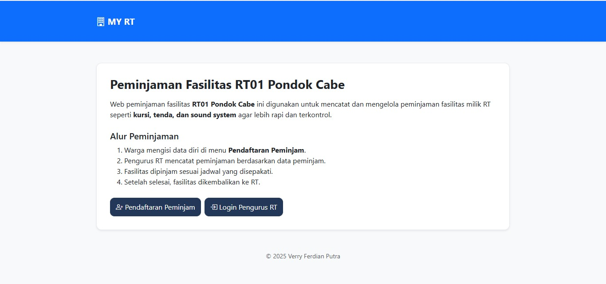
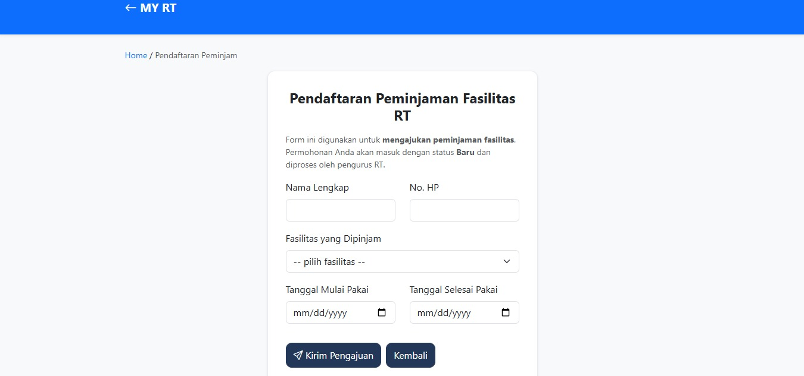
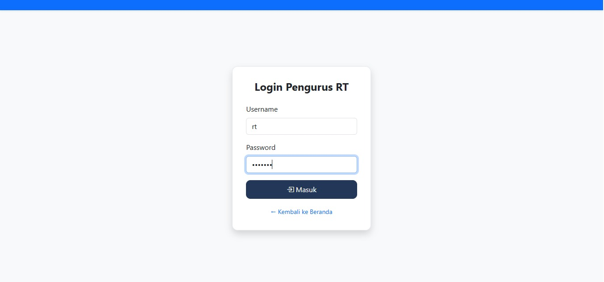
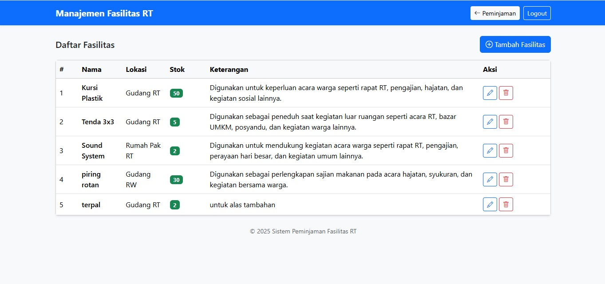

# MyRT
Aplikasi Peminjaman Fasilitas RT

## 📌 Deskripsi
MyRT adalah aplikasi berbasis web yang digunakan untuk mengelola peminjaman fasilitas RT seperti aula, kursi, tenda, dan fasilitas lainnya.  
Aplikasi ini dibuat untuk membantu pengurus RT dan warga agar proses peminjaman menjadi lebih tertib, transparan, dan terdokumentasi dengan baik.

## 🎯 Tujuan Aplikasi
- Mempermudah warga dalam mengajukan peminjaman fasilitas RT
- Membantu pengurus RT dalam mengelola data peminjaman
- Mengurangi pencatatan manual
- Menyediakan riwayat peminjaman yang jelas

## 🚀 Fitur Utama
- Pengajuan peminjaman fasilitas RT
- Manajemen data fasilitas
- Manajemen data peminjam
- Status peminjaman (menunggu, disetujui, ditolak)
- Riwayat peminjaman fasilitas

## 🖼️ Tampilan Aplikasi

### Halaman Utama

### Form Peminjaman

### Tampilan Login Admin

### Tampilan Dashboard Peminjaman (Admin)

### Tampilan Manajemen Fasiltas

### Tampilan Tambah Fasilitas

## 🛠️ Teknologi yang Digunakan
- PHP
- MySQL
- HTML
- CSS

## 📂 Instalasi
1. Clone repository ini
2. Import file database `.sql` ke MySQL
3. Jalankan aplikasi menggunakan web server (XAMPP / Laragon)
4. Akses melalui browser

## 📄 Author
- Verry ferdian Putra (221011402923)
- Aplikasi ini dibuat untuk memenuhi tugas pemrograman web 2
